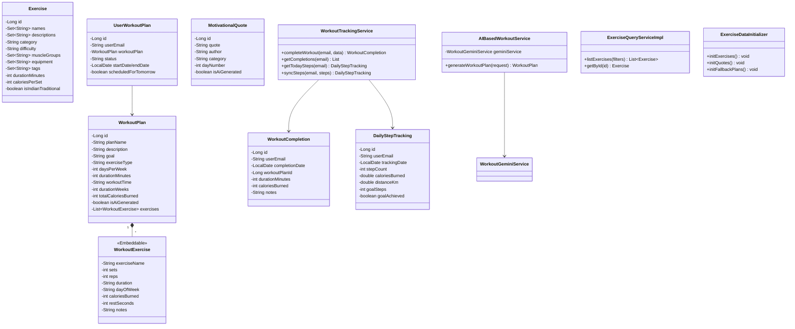

# Exercise Service — Class Diagram

```mermaid
classDiagram
    class Exercise {
        -Long id
        -Set~String~ names
        -Set~String~ descriptions
        -String category
        -String difficulty
        -Set~String~ muscleGroups
        -Set~String~ equipment
        -Set~String~ tags
        -int durationMinutes
        -int caloriesPerSet
        -boolean isIndianTraditional
    }

    class WorkoutPlan {
        -Long id
        -String planName
        -String description
        -String goal
        -String exerciseType
        -int daysPerWeek
        -int durationMinutes
        -String workoutTime
        -int durationWeeks
        -int totalCaloriesBurned
        -boolean isAiGenerated
        -List~WorkoutExercise~ exercises
    }

    class WorkoutExercise {
        <<Embeddable>>
        -String exerciseName
        -int sets
        -int reps
        -String duration
        -String dayOfWeek
        -int caloriesBurned
        -int restSeconds
        -String notes
    }

    class UserWorkoutPlan {
        -Long id
        -String userEmail
        -WorkoutPlan workoutPlan
        -String status
        -LocalDate startDate/endDate
        -boolean scheduledForTomorrow
    }

    class WorkoutCompletion {
        -Long id
        -String userEmail
        -LocalDate completionDate
        -Long workoutPlanId
        -int durationMinutes
        -int caloriesBurned
        -String notes
    }

    class DailyStepTracking {
        -Long id
        -String userEmail
        -LocalDate trackingDate
        -int stepCount
        -double caloriesBurned
        -double distanceKm
        -int goalSteps
        -boolean goalAchieved
    }

    class MotivationalQuote {
        -Long id
        -String quote
        -String author
        -String category
        -int dayNumber
        -boolean isAiGenerated
    }

    class AIBasedWorkoutService {
        -WorkoutGeminiService geminiService
        +generateWorkoutPlan(request) WorkoutPlan
    }

    class WorkoutTrackingService {
        +completeWorkout(email, data) WorkoutCompletion
        +getCompletions(email) List
        +getTodaySteps(email) DailyStepTracking
        +syncSteps(email, steps) DailyStepTracking
    }

    class ExerciseQueryServiceImpl {
        +listExercises(filters) List~Exercise~
        +getById(id) Exercise
    }

    class ExerciseDataInitializer {
        +initExercises() void
        +initQuotes() void
        +initFallbackPlans() void
    }

    WorkoutPlan "1" *-- "*" WorkoutExercise
    UserWorkoutPlan --> WorkoutPlan
    AIBasedWorkoutService --> WorkoutGeminiService
    WorkoutTrackingService --> WorkoutCompletion
    WorkoutTrackingService --> DailyStepTracking
```

