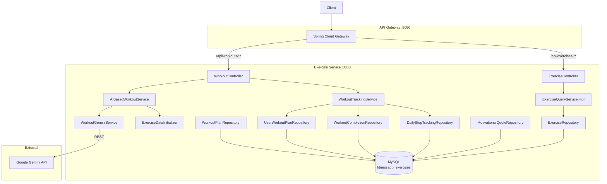

# Exercise Service — High-Level Design (HLD)

## 1. Service Overview
The Exercise Service manages workout plan generation (AI + fallback), exercise library, workout tracking, step counting, and motivational quotes. It is a self-contained microservice on port 8083.

## 2. Component Diagram

## 3. Key Design Decisions

### AI-Powered Workout Generation
- Gemini AI generates workout plans based on exercise type, goal, days, duration
- Fallback to pre-built plans (gym beginner/intermediate, running, yoga)
- Plans include exercises with sets, reps, day-of-week scheduling

### Step Tracking Architecture
- Mobile app uses `expo-sensors` Pedometer for real-time step counting
- Steps synced to backend via `/workouts/steps/sync` endpoint
- Daily reset at midnight, historical data persisted in `daily_step_tracking`

### Motivational System
- 30 pre-built quotes loaded by `ExerciseDataInitializer`
- Daily rotation based on `dayNumber` (1-30, then repeat)
- AI-generated quotes attempted first, fallback to pre-built

## 4. API Gateway Routing
| Gateway Path | Routed To |
|-------------|-----------|
| `/api/workouts/**` | `exercise-service/workouts/**` |
| `/api/exercises/**` | `exercise-service/exercises/**` |

