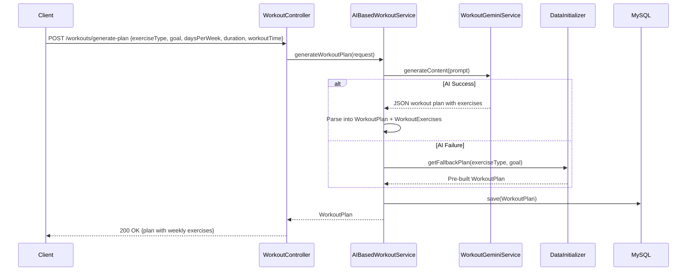
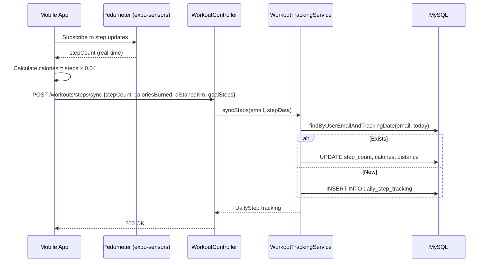

# Exercise Service — Low-Level Design (LLD)

## 1. Workout Plan Generation Flow



## 2. Step Tracking Flow



## 3. API Specifications

### POST `/workouts/generate-plan`
```json
// Request
{
  "exerciseType": "GYM", "goal": "MUSCLE_BUILDING",
  "daysPerWeek": 5, "durationMinutes": 60,
  "workoutTime": "6:00 AM", "gender": "MALE"
}

// Response
{
  "id": 1, "planName": "5-Day Muscle Building",
  "exercises": [
    { "exerciseName": "Bench Press", "sets": 4, "reps": 10, "dayOfWeek": "MONDAY", "caloriesBurned": 80 },
    { "exerciseName": "Squats", "sets": 4, "reps": 12, "dayOfWeek": "TUESDAY", "caloriesBurned": 100 }
  ],
  "totalCaloriesBurned": 2500
}
```

### POST `/workouts/my-plan/assign`
```json
// Request
{ "planId": 1 }
// Response: UserWorkoutPlan with status ACTIVE
```

### POST `/workouts/my-plan/complete`
```json
// Request
{ "durationMinutes": 55, "caloriesBurned": 450, "notes": "Good session" }
```

### POST `/workouts/steps/sync`
```json
// Request
{ "stepCount": 8500, "caloriesBurned": 340, "distanceKm": 6.2, "goalSteps": 10000 }
```

### GET `/workouts/steps/today`
Returns today's `DailyStepTracking` record.

### GET `/workouts/quotes/today`
Returns today's motivational quote based on `dayNumber = dayOfYear % 30 + 1`.

## 4. Pre-built Fallback Plans
- **GYM Beginner (3 days)** — Push/Pull/Legs
- **GYM Intermediate (5 days)** — Chest, Back, Legs, Shoulders, Arms
- **Running Plan** — Progressive distance increase
- **Yoga Plan** — Sun Salutation, Standing, Balance poses

## 5. Error Handling
| Error | HTTP Code | Message |
|-------|-----------|---------|
| No active plan | 404 | "No active workout plan" |
| AI keys exhausted | 400 | "All API keys exhausted" |
| Already completed today | 400 | "Workout already completed today" |
| Plan not found | 404 | "Plan not found" |

