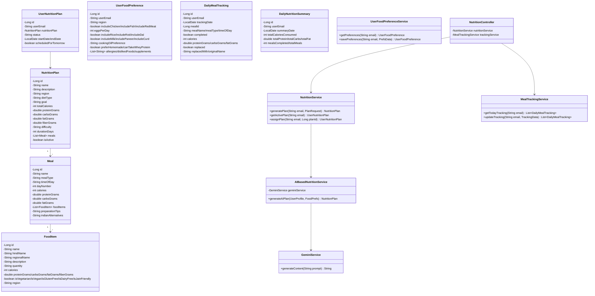

# Nutrition Service — Class Diagram

```mermaid
classDiagram
    class NutritionPlan {
        -Long id
        -String name
        -String description
        -String region
        -String dietType
        -String goal
        -int totalCalories
        -double proteinGrams
        -double carbsGrams
        -double fatGrams
        -double fiberGrams
        -String difficulty
        -int durationDays
        -List~Meal~ meals
        -boolean isActive
    }

    class Meal {
        -Long id
        -String name
        -String mealType
        -String timeOfDay
        -int dayNumber
        -int calories
        -double proteinGrams
        -double carbsGrams
        -double fatGrams
        -List~FoodItem~ foodItems
        -String preparationTips
        -String indianAlternatives
    }

    class FoodItem {
        -Long id
        -String name
        -String hindiName
        -String regionalName
        -String description
        -String quantity
        -int calories
        -double proteinGrams/carbsGrams/fatGrams/fiberGrams
        -boolean isVegetarian/isVegan/isGlutenFree/isDairyFree/isJainFriendly
        -String region
    }

    class UserNutritionPlan {
        -Long id
        -String userEmail
        -NutritionPlan nutritionPlan
        -String status
        -LocalDate startDate/endDate
        -boolean scheduledForTomorrow
    }

    class UserFoodPreference {
        -Long id
        -String userEmail
        -String region
        -boolean includeChicken/includeFish/includeRedMeat
        -int eggsPerDay
        -boolean includeRice/includeRoti/includeDal
        -boolean includeMilk/includePaneer/includeCurd
        -String cookingOilPreference
        -boolean preferHomemade/canTakeWheyProtein
        -List~String~ allergies/dislikedFoods/supplements
    }

    class DailyMealTracking {
        -Long id
        -String userEmail
        -LocalDate trackingDate
        -Long mealId
        -String mealName/mealType/timeOfDay
        -boolean completed
        -int calories
        -double proteinGrams/carbsGrams/fatGrams
        -boolean replaced
        -String replacedWith/originalName
    }

    class DailyNutritionSummary {
        -Long id
        -String userEmail
        -LocalDate summaryDate
        -int totalCaloriesConsumed
        -double totalProtein/totalCarbs/totalFat
        -int mealsCompleted/totalMeals
    }

    class NutritionService {
        +generatePlan(String email, PlanRequest) NutritionPlan
        +getActivePlan(String email) UserNutritionPlan
        +assignPlan(String email, Long planId) UserNutritionPlan
    }

    class AIBasedNutritionService {
        -GeminiService geminiService
        +generateAIPlan(UserProfile, FoodPrefs) NutritionPlan
    }

    class MealTrackingService {
        +getTodayTracking(String email) List~DailyMealTracking~
        +updateTracking(String email, TrackingData) List~DailyMealTracking~
    }

    class UserFoodPreferenceService {
        +getPreferences(String email) UserFoodPreference
        +savePreferences(String email, PrefsData) UserFoodPreference
    }

    class GeminiService {
        +generateContent(String prompt) String
    }

    class NutritionController {
        -NutritionService nutritionService
        -MealTrackingService trackingService
    }

    NutritionPlan "1" --> "*" Meal
    Meal "1" --> "*" FoodItem
    UserNutritionPlan --> NutritionPlan
    NutritionService --> AIBasedNutritionService
    AIBasedNutritionService --> GeminiService
    NutritionController --> NutritionService
    NutritionController --> MealTrackingService
```

