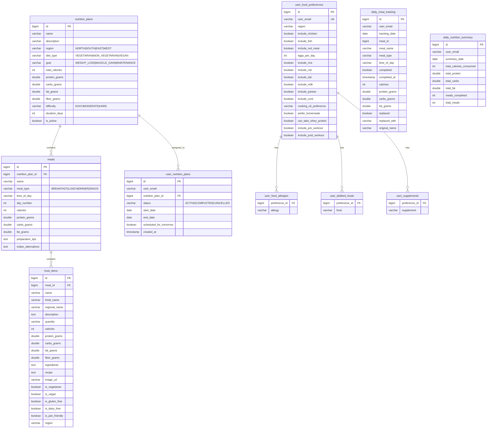

# Nutrition Service — Database Architecture

## Database: `fitnessapp_nutrition`

### ER Diagram

### Table Summary

| Table | Records | Purpose |
|-------|---------|---------|
| nutrition_plans | Low (pre-built + generated) | Plan templates |
| meals | ~3-5 per plan | Individual meals |
| food_items | ~2-5 per meal | Food items in each meal |
| user_nutrition_plans | 1 per user | Active plan assignment |
| user_food_preferences | 1 per user | Food preference configuration |
| daily_meal_tracking | ~3-5 per user/day | Daily meal completion |
| daily_nutrition_summary | 1 per user/day | Daily macro totals |

### Unique Constraints
- `uk_user_nutrition_plan` — (user_email, status='ACTIVE')
- `uk_user_food_pref` — (user_email) on user_food_preferences
- `uk_meal_tracking_user_date_meal` — (user_email, tracking_date, meal_id)

