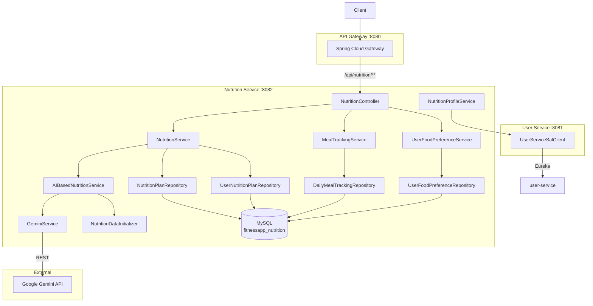

# Nutrition Service — High-Level Design (HLD)

## 1. Service Overview
The Nutrition Service manages personalized diet plan generation, food preferences, meal tracking, and daily nutrition summaries. It uses Gemini AI for personalized plan generation with pre-built fallback plans.

## 2. Component Diagram



## 3. Key Design Decisions

### AI with Fallback
1. User submits food preferences + profile data
2. Service attempts Gemini AI plan generation
3. If AI fails → falls back to pre-built regional plans (loaded by `NutritionDataInitializer`)
4. Generated plans are saved to DB for reuse

### Inter-Service Communication
- Uses `user-service-sal` dependency (published to mavenLocal)
- `UserServiceSalClient` calls user-service via Eureka-discovered REST
- Fetches user profile/health data for plan customization

### Plan Assignment Strategy
- Only one ACTIVE plan per user at a time
- New plan creation while existing plan → scheduled for tomorrow
- Old plan stays active until midnight, then auto-switches

## 4. Module Structure
```
nutrition-service/
├── api/nutrition-service-api.yaml     # OpenAPI contract
├── nutrition-service-common/          # DTOs, interfaces
├── nutrition-service-rest/            # Controllers
└── nutrition-service-impl/            # Services, JPA, Boot app
```

## 5. API Gateway Routing
| Gateway Path | Routed To |
|-------------|-----------|
| `/api/nutrition/**` | `nutrition-service/nutrition/**` |

