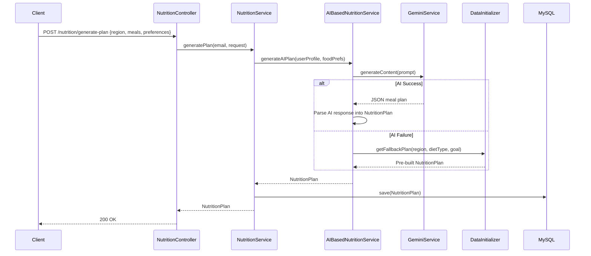
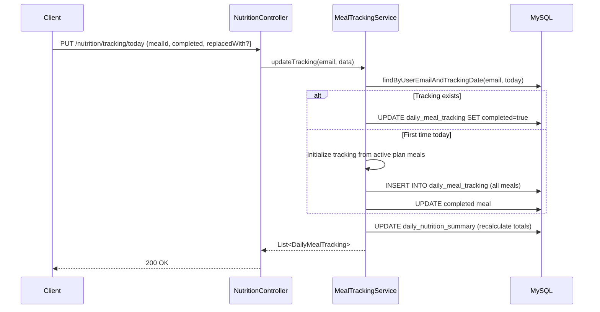

# Nutrition Service — Low-Level Design (LLD)

## 1. Plan Generation Flow



## 2. Meal Tracking Flow



## 3. API Specifications

### POST `/nutrition/generate-plan`
```json
// Request
{
  "region": "NORTH",
  "customMeals": [{"name": "Breakfast", "type": "BREAKFAST", "time": "8:00 AM", "enabled": true}],
  "includePreWorkoutMeal": false,
  "includePostWorkoutMeal": true,
  "canTakeWheyProtein": true,
  "foodPreferences": {
    "includeChicken": true, "includeFish": false,
    "eggsPerDay": 4, "includeRice": true,
    "cookingOilPreference": "GHEE", "preferHomemade": true,
    "allergies": [], "dislikedFoods": ["mushroom"]
  }
}

// Response
{
  "id": 3,
  "name": "Personalized WEIGHT_LOSS Plan (NON_VEGETARIAN)",
  "region": "NORTH", "dietType": "NON_VEGETARIAN", "goal": "WEIGHT_LOSS",
  "totalCalories": 1900,
  "meals": [
    { "name": "Breakfast", "mealType": "BREAKFAST", "timeOfDay": "8:00 AM",
      "calories": 450,
      "foodItems": [{"name": "Egg Bhurji", "hindiName": "अंडा भुर्जी", "calories": 250, ...}]
    }
  ]
}
```

### GET `/nutrition/my-plan`
Returns the user's active `UserNutritionPlan` with nested `NutritionPlan`, `Meals`, and `FoodItems`.

### PUT `/nutrition/tracking/today`
```json
// Request
{
  "meals": [
    {"mealId": 6, "completed": true},
    {"mealId": 7, "completed": false, "replaced": true, "replacedWith": "Chicken Sandwich", "calories": 350}
  ]
}
```

### GET `/nutrition/tracking/today`
Returns today's `List<DailyMealTracking>` + `DailyNutritionSummary`.

## 4. Service Layer Methods

### NutritionService
| Method | Description |
|--------|-------------|
| `generatePlan(email, request)` | Generate plan via AI or fallback |
| `getActivePlan(email)` | Get current active plan |
| `assignPlan(email, planId)` | Assign plan (schedule if existing) |

### MealTrackingService
| Method | Description |
|--------|-------------|
| `getTodayTracking(email)` | Get all meal tracking for today |
| `updateTracking(email, data)` | Mark meals completed/replaced |

### UserFoodPreferenceService
| Method | Description |
|--------|-------------|
| `getPreferences(email)` | Get saved food preferences |
| `savePreferences(email, data)` | Save/update preferences |

## 5. Pre-built Fallback Plans
The `NutritionDataInitializer` loads on startup:
- **Basic North Indian Vegetarian Plan** — 2000 cal, Aloo Paratha, Dal Rice, Sabzi
- **Basic Non-Veg Plan** — 2200 cal, Eggs, Chicken, Rice, Curd
- Customized based on region (NORTH/SOUTH/EAST/WEST)

## 6. Error Handling
| Error | HTTP Code | Message |
|-------|-----------|---------|
| No active plan | 404 | "No active nutrition plan found" |
| AI keys exhausted | 400 | "All API keys exhausted" |
| Duplicate tracking | 400 | "Duplicate entry for meal tracking" |
| Invalid food prefs | 400 | Validation error details |

