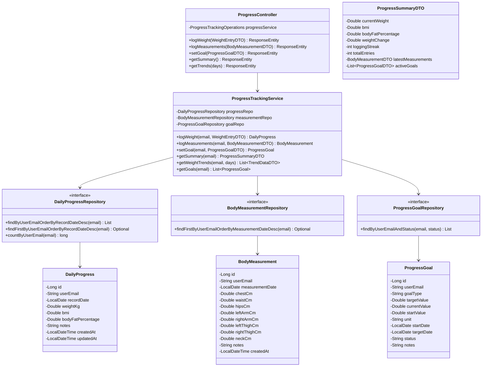

# Progress Service — Class Diagram

```mermaid
classDiagram
    class DailyProgress {
        -Long id
        -String userEmail
        -LocalDate recordDate
        -Double weightKg
        -Double bmi
        -Double bodyFatPercentage
        -String notes
        -LocalDateTime createdAt
        -LocalDateTime updatedAt
    }

    class BodyMeasurement {
        -Long id
        -String userEmail
        -LocalDate measurementDate
        -Double chestCm
        -Double waistCm
        -Double hipsCm
        -Double leftArmCm
        -Double rightArmCm
        -Double leftThighCm
        -Double rightThighCm
        -Double neckCm
        -String notes
        -LocalDateTime createdAt
    }

    class ProgressGoal {
        -Long id
        -String userEmail
        -String goalType
        -Double targetValue
        -Double currentValue
        -Double startValue
        -String unit
        -LocalDate startDate
        -LocalDate targetDate
        -String status
        -String notes
    }

    class ProgressTrackingService {
        -DailyProgressRepository progressRepo
        -BodyMeasurementRepository measurementRepo
        -ProgressGoalRepository goalRepo
        +logWeight(email, WeightEntryDTO) DailyProgress
        +logMeasurements(email, BodyMeasurementDTO) BodyMeasurement
        +setGoal(email, ProgressGoalDTO) ProgressGoal
        +getSummary(email) ProgressSummaryDTO
        +getWeightTrends(email, days) List~TrendDataDTO~
        +getGoals(email) List~ProgressGoal~
    }

    class ProgressController {
        -ProgressTrackingOperations progressService
        +logWeight(WeightEntryDTO) ResponseEntity
        +logMeasurements(BodyMeasurementDTO) ResponseEntity
        +setGoal(ProgressGoalDTO) ResponseEntity
        +getSummary() ResponseEntity
        +getTrends(days) ResponseEntity
    }

    class DailyProgressRepository {
        <<interface>>
        +findByUserEmailOrderByRecordDateDesc(email) List
        +findFirstByUserEmailOrderByRecordDateDesc(email) Optional
        +countByUserEmail(email) long
    }

    class BodyMeasurementRepository {
        <<interface>>
        +findFirstByUserEmailOrderByMeasurementDateDesc(email) Optional
    }

    class ProgressGoalRepository {
        <<interface>>
        +findByUserEmailAndStatus(email, status) List
    }

    class ProgressSummaryDTO {
        -Double currentWeight
        -Double bmi
        -Double bodyFatPercentage
        -Double weightChange
        -int loggingStreak
        -int totalEntries
        -BodyMeasurementDTO latestMeasurements
        -List~ProgressGoalDTO~ activeGoals
    }

    ProgressController --> ProgressTrackingService
    ProgressTrackingService --> DailyProgressRepository
    ProgressTrackingService --> BodyMeasurementRepository
    ProgressTrackingService --> ProgressGoalRepository
    DailyProgressRepository --> DailyProgress
    BodyMeasurementRepository --> BodyMeasurement
    ProgressGoalRepository --> ProgressGoal
```

