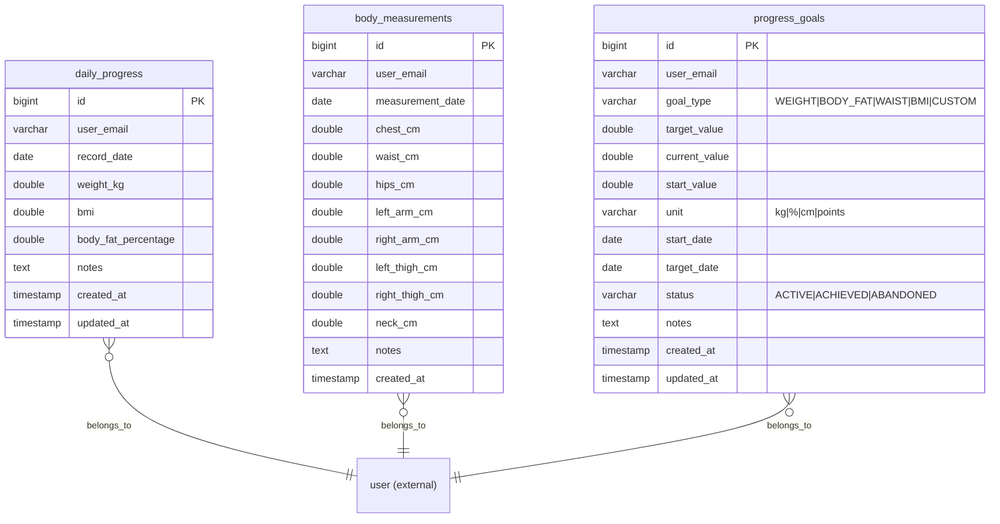

# Progress Service — Database Architecture

## Database: `fitnessapp_progress`

### ER Diagram

### Table Details

#### `daily_progress`
| Column | Type | Constraints | Description |
|--------|------|-------------|-------------|
| id | BIGINT | PK, AUTO_INCREMENT | |
| user_email | VARCHAR(255) | NOT NULL, INDEX | User identifier |
| record_date | DATE | NOT NULL | Date of recording |
| weight_kg | DOUBLE | | Weight in kilograms |
| bmi | DOUBLE | | Calculated BMI |
| body_fat_percentage | DOUBLE | | Body fat % |
| notes | TEXT | | Optional notes |

#### `body_measurements`
| Column | Type | Constraints | Description |
|--------|------|-------------|-------------|
| id | BIGINT | PK | |
| user_email | VARCHAR(255) | NOT NULL | |
| measurement_date | DATE | NOT NULL | |
| chest_cm | DOUBLE | | Chest circumference |
| waist_cm | DOUBLE | | Waist circumference |
| hips_cm | DOUBLE | | Hip circumference |
| left_arm_cm / right_arm_cm | DOUBLE | | Arm measurements |
| left_thigh_cm / right_thigh_cm | DOUBLE | | Thigh measurements |
| neck_cm | DOUBLE | | Neck circumference |

#### `progress_goals`
| Column | Type | Constraints | Description |
|--------|------|-------------|-------------|
| id | BIGINT | PK | |
| user_email | VARCHAR(255) | NOT NULL | |
| goal_type | VARCHAR(20) | NOT NULL | WEIGHT, BODY_FAT, WAIST, BMI, CUSTOM |
| target_value | DOUBLE | NOT NULL | Target to achieve |
| current_value | DOUBLE | | Latest value |
| start_value | DOUBLE | | Value when goal was set |
| unit | VARCHAR(10) | | kg, %, cm, points |
| start_date | DATE | | Goal start |
| target_date | DATE | | Target completion date |
| status | VARCHAR(20) | | ACTIVE, ACHIEVED, ABANDONED |

### Indexes
- `idx_daily_progress_user_date` — (user_email, record_date)
- `idx_body_measurements_user_date` — (user_email, measurement_date)
- `idx_progress_goals_user_status` — (user_email, status)

