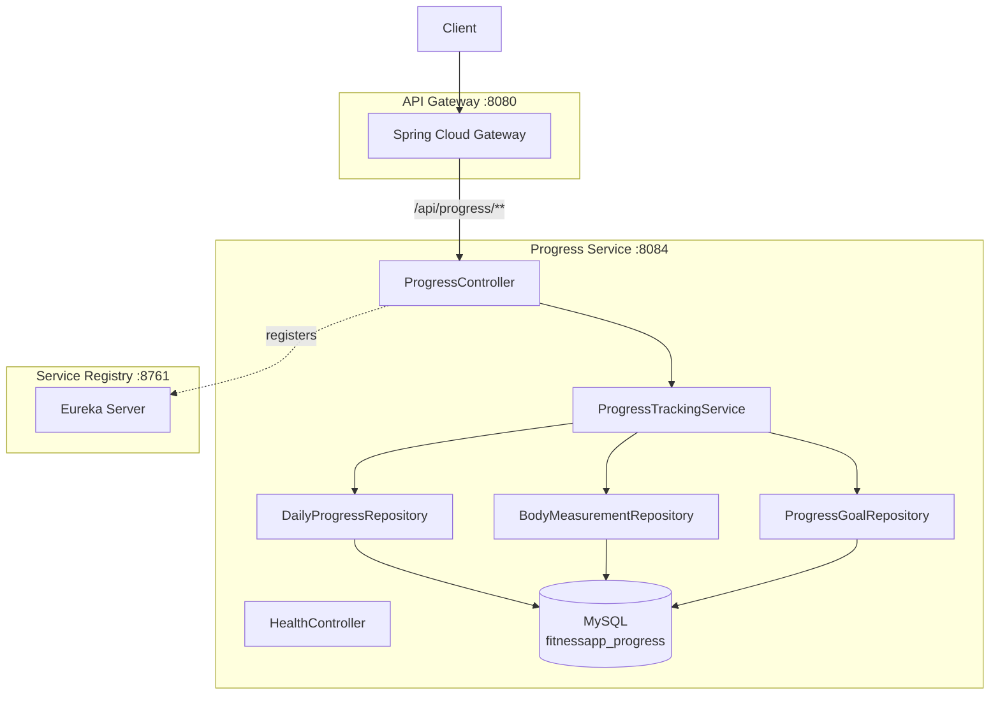

# Progress Service — High-Level Design (HLD)

## 1. Service Overview
The Progress Service tracks user body metrics over time — weight, BMI, body measurements, and fitness goals. It provides trend analysis and progress summaries.

## 2. Component Diagram



## 3. Key Design Decisions

### Standalone Service
- No inter-service dependencies — self-contained bounded context
- All data identified by `userEmail` (no foreign key to user-service DB)
- Lightweight — only 3 tables

### Streak Calculation
- Counts consecutive days with weight entries
- Gaps break the streak
- Calculated on-the-fly from `daily_progress` records

### Goal Progress
- Goals have `start_value`, `current_value`, `target_value`
- Progress percentage calculated as `(start - current) / (start - target) × 100`
- Auto-updates `current_value` when new weight/measurement is logged

## 4. Module Structure
```
progress-service/
├── api/progress-service-api.yaml      # OpenAPI contract
├── progress-service-common/           # DTOs: WeightEntryDTO, BodyMeasurementDTO, ProgressGoalDTO, ProgressSummaryDTO, TrendDataDTO
├── progress-service-rest/             # ProgressController, HealthController
└── progress-service-impl/             # ProgressTrackingService, JPA entities, repositories
```

## 5. API Gateway Routing
| Gateway Path | Routed To |
|-------------|-----------|
| `/api/progress/**` | `progress-service/progress/**` |

## 6. Technology Stack
| Component | Technology |
|-----------|-----------|
| Framework | Spring Boot 3.2 |
| Database | MySQL 8 |
| ORM | Spring Data JPA |
| Security | JWT (common-lib) |
| Discovery | Eureka Client |
| Port | 8084 |

