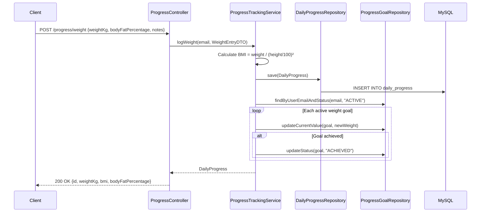
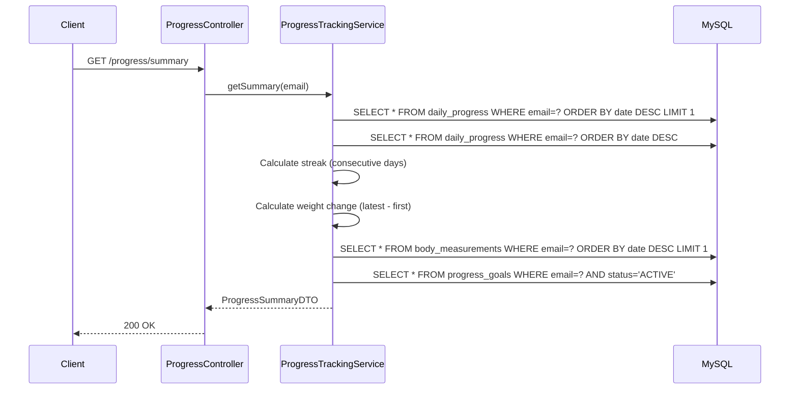

# Progress Service — Low-Level Design (LLD)

## 1. Weight Logging Flow



## 2. Summary Calculation Flow



## 3. API Specifications

### POST `/progress/weight`
```json
// Request
{ "weightKg": 78.5, "bodyFatPercentage": 22.0, "notes": "Morning weight" }

// Response 200
{ "id": 15, "userEmail": "user@example.com", "recordDate": "2026-03-01", "weightKg": 78.5, "bmi": 25.6, "bodyFatPercentage": 22.0 }
```

### POST `/progress/measurements`
```json
// Request
{ "chestCm": 100, "waistCm": 85, "hipsCm": 95, "leftArmCm": 35, "rightArmCm": 35.5, "leftThighCm": 55, "rightThighCm": 55, "neckCm": 38, "notes": "Weekly measurement" }

// Response 200
{ "id": 5, "measurementDate": "2026-03-01", ... }
```

### POST `/progress/goals`
```json
// Request
{ "goalType": "WEIGHT", "targetValue": 72.0, "unit": "kg", "targetDate": "2026-06-01", "notes": "Lose 8kg in 3 months" }

// Response 200
{ "id": 3, "goalType": "WEIGHT", "startValue": 80.0, "currentValue": 78.5, "targetValue": 72.0, "status": "ACTIVE", "progressPercentage": 18.75 }
```

### GET `/progress/summary`
```json
{
  "currentWeight": 78.5, "bmi": 25.6, "bodyFatPercentage": 22.0,
  "weightChange": -1.5, "loggingStreak": 12, "totalEntries": 45,
  "latestMeasurements": { "chestCm": 100, "waistCm": 85, ... },
  "activeGoals": [{ "goalType": "WEIGHT", "progressPercentage": 18.75, ... }]
}
```

### GET `/progress/trends?days=30`
```json
[
  { "date": "2026-02-01", "weight": 80.0, "bmi": 26.1 },
  { "date": "2026-02-15", "weight": 79.2, "bmi": 25.9 },
  { "date": "2026-03-01", "weight": 78.5, "bmi": 25.6 }
]
```

## 4. Service Layer Methods

| Method | Parameters | Returns | Description |
|--------|-----------|---------|-------------|
| `logWeight` | email, WeightEntryDTO | DailyProgress | Log weight + calc BMI |
| `logMeasurements` | email, BodyMeasurementDTO | BodyMeasurement | Log body measurements |
| `setGoal` | email, ProgressGoalDTO | ProgressGoal | Create/update goal |
| `getSummary` | email | ProgressSummaryDTO | Full progress summary |
| `getWeightTrends` | email, days | List\<TrendDataDTO\> | Weight trend data |
| `getGoals` | email | List\<ProgressGoal\> | Active goals |

## 5. BMI Calculation
```
BMI = weight (kg) / [height (m)]²
height fetched from user profile or provided in request
Categories: <18.5 Underweight, 18.5-24.9 Normal, 25-29.9 Overweight, ≥30 Obese
```

## 6. Error Handling
| Error | HTTP Code | Message |
|-------|-----------|---------|
| Weight not positive | 400 | "Weight must be positive" |
| Goal type invalid | 400 | "Invalid goal type" |
| Target date in past | 400 | "Target date must be in future" |
| No records found | 200 | Returns empty summary |

