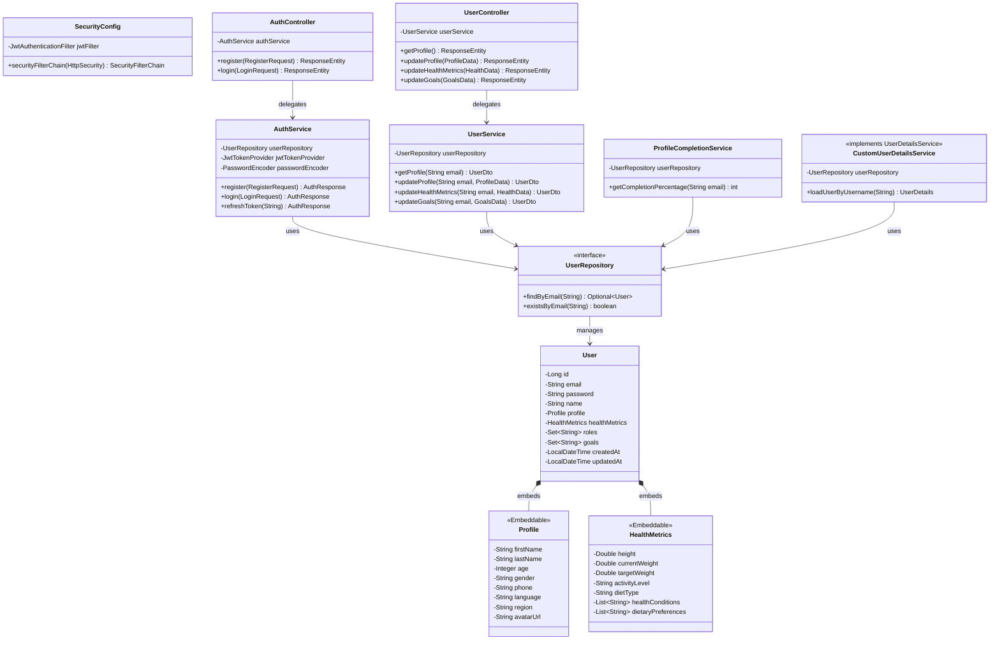

# User Service — Class Diagram

## Key Design Patterns
- **Embeddable Pattern** — `Profile` and `HealthMetrics` are `@Embeddable` classes stored in the same `users` table
- **Interface-Driven** — Controllers in `rest` module depend on interfaces defined in `common`
- **Repository Pattern** — Spring Data JPA repositories for data access
- **Service Layer** — Business logic isolated in service classes

