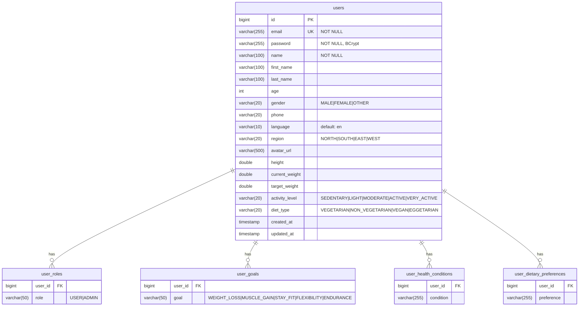

# User Service — Database Architecture

## Database: `fitnessapp_users`

### ER Diagram

### Table Details

#### `users` (Primary Table)
| Column | Type | Constraints | Description |
|--------|------|-------------|-------------|
| id | BIGINT | PK, AUTO_INCREMENT | Primary key |
| email | VARCHAR(255) | UNIQUE, NOT NULL | User email (login identifier) |
| password | VARCHAR(255) | NOT NULL | BCrypt hashed password |
| name | VARCHAR(100) | NOT NULL | Display name |
| first_name | VARCHAR(100) | | Profile first name |
| last_name | VARCHAR(100) | | Profile last name |
| age | INT | | User age |
| gender | VARCHAR(20) | | MALE, FEMALE, OTHER |
| phone | VARCHAR(20) | | Phone number |
| language | VARCHAR(10) | DEFAULT 'en' | i18n language code |
| region | VARCHAR(20) | | NORTH, SOUTH, EAST, WEST |
| avatar_url | VARCHAR(500) | | Profile picture URL |
| height | DOUBLE | | Height in cm |
| current_weight | DOUBLE | | Current weight in kg |
| target_weight | DOUBLE | | Target weight in kg |
| activity_level | VARCHAR(20) | | Activity level enum |
| diet_type | VARCHAR(20) | | Dietary preference |
| created_at | TIMESTAMP | DEFAULT CURRENT_TIMESTAMP | |
| updated_at | TIMESTAMP | ON UPDATE CURRENT_TIMESTAMP | |

#### `user_roles` (ElementCollection)
| Column | Type | Constraints |
|--------|------|-------------|
| user_id | BIGINT | FK → users.id |
| role | VARCHAR(50) | USER, ADMIN |

#### `user_goals` (ElementCollection)
| Column | Type | Constraints |
|--------|------|-------------|
| user_id | BIGINT | FK → users.id |
| goal | VARCHAR(50) | Goal enum value |

#### `user_health_conditions` (ElementCollection)
| Column | Type | Constraints |
|--------|------|-------------|
| user_id | BIGINT | FK → users.id |
| condition | VARCHAR(255) | Free text or predefined |

#### `user_dietary_preferences` (ElementCollection)
| Column | Type | Constraints |
|--------|------|-------------|
| user_id | BIGINT | FK → users.id |
| preference | VARCHAR(255) | Dietary preference |

### Indexes
- `uk_users_email` — UNIQUE on `email`
- Primary key on `id`

### Liquibase Migrations
- `db/changelog/db.changelog-master.yaml` → includes changes
- Initial schema created by JPA `hibernate.ddl-auto=update`
- Future migrations managed via Liquibase changesets

