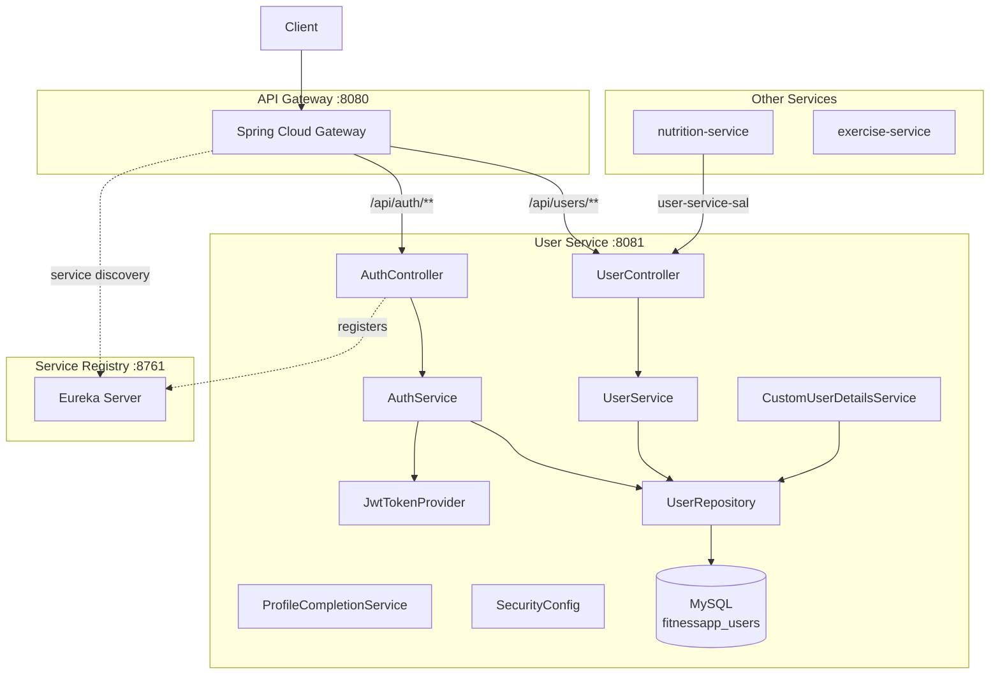

# User Service — High-Level Design (HLD)

## 1. Service Overview

The User Service is the central identity and authentication microservice. It manages user registration, login, JWT token lifecycle, user profiles, health metrics, and fitness goals.

## 2. Component Diagram



## 3. Deployment Architecture

| Component | Technology | Port |
|-----------|-----------|------|
| Application | Spring Boot 3.2 | 8081 |
| Database | MySQL 8+ | 3306 |
| Discovery | Eureka Client | — |
| Security | JWT + BCrypt | — |

## 4. Module Structure

```
user-service/
├── user-service-common/     → DTOs, interfaces (published to mavenLocal)
├── user-service-rest/       → Controllers, OpenAPI codegen
├── user-service-sal/        → SAL client for inter-service calls (published to mavenLocal)
└── user-service-impl/       → Services, JPA entities, repositories, configs (bootable JAR)
```

Dependency flow: `common ← rest ← impl`

## 5. Inter-Service Communication

The User Service provides a **SAL (Service Abstraction Layer)** client module (`user-service-sal`) that other services can depend on. This SAL client uses `@LoadBalanced RestTemplate` with Eureka service discovery to call user-service endpoints.

**Consumers:**
- `nutrition-service` → fetches user profile/health data for plan generation
- Other services can add the SAL dependency to access user data

## 6. Security Architecture

1. **Registration** — BCrypt password hashing, store user with ROLE_USER
2. **Login** — Validate credentials, generate JWT access + refresh tokens
3. **JWT Validation** — `JwtAuthenticationFilter` (from common-lib) validates token on every request
4. **Public Endpoints** — `/auth/register`, `/auth/login`, `/health`
5. **Protected Endpoints** — All `/users/**` endpoints require valid JWT

## 7. API Gateway Routing

| Gateway Path | Routed To |
|-------------|-----------|
| `/api/auth/**` | `user-service/auth/**` |
| `/api/users/**` | `user-service/users/**` |

## 8. Technology Choices

| Concern | Choice | Rationale |
|---------|--------|-----------|
| ORM | Spring Data JPA + Hibernate | Standard, well-supported |
| Password | BCrypt | Industry standard, adaptive |
| Token | JWT (HMAC-SHA256) | Stateless, scalable |
| API Contract | OpenAPI 3.0 | Contract-first development |
| Discovery | Eureka | Spring Cloud native |

