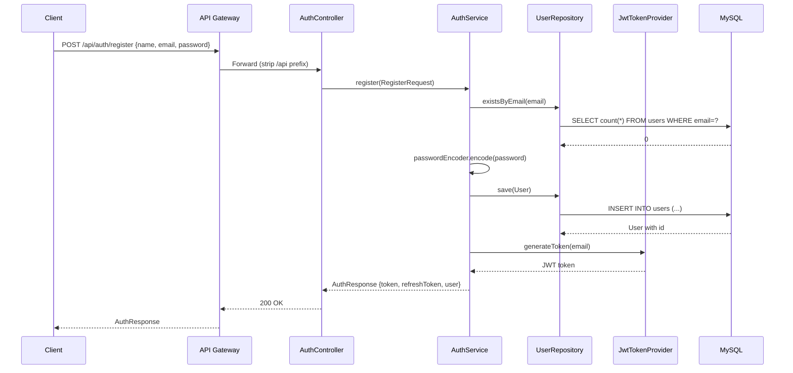
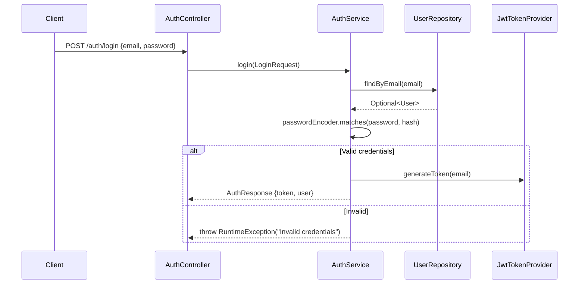

# User Service — Low-Level Design (LLD)

## 1. Authentication Flow

### 1.1 Registration Sequence



### 1.2 Login Sequence



## 2. API Specifications

### 2.1 Auth Endpoints

#### POST `/auth/register`
```json
// Request
{ "name": "Sachin", "email": "sachin@example.com", "password": "Pass123!" }

// Response 200
{
  "token": "eyJhbGc...",
  "refreshToken": "eyJhbGc...",
  "user": { "email": "sachin@example.com", "name": "Sachin", "profile": {...} }
}
```

#### POST `/auth/login`
```json
// Request
{ "email": "sachin@example.com", "password": "Pass123!" }

// Response 200
{ "token": "eyJhbGc...", "refreshToken": "...", "user": {...} }
```

### 2.2 Profile Endpoints

#### GET `/users/profile`
- **Auth**: Bearer JWT required
- **Response**: Full user object with profile, healthMetrics, goals

#### PUT `/users/profile`
```json
// Request
{ "firstName": "Sachin", "lastName": "Bisht", "age": 28, "gender": "MALE", "phone": "9876543210", "language": "hi", "region": "NORTH" }
```

#### PUT `/users/health-metrics`
```json
// Request
{ "height": 175, "currentWeight": 80, "targetWeight": 72, "activityLevel": "MODERATE", "dietType": "NON_VEGETARIAN", "healthConditions": ["None"], "dietaryPreferences": [] }
```

#### PUT `/users/goals`
```json
// Request
{ "goals": ["WEIGHT_LOSS", "MUSCLE_GAIN"] }
```

## 3. Entity Design

### User Entity
```java
@Entity @Table(name = "users")
public class User {
    @Id @GeneratedValue Long id;
    @Column(unique = true) String email;
    String password;  // BCrypt hashed
    String name;

    @Embedded Profile profile;      // firstName, lastName, age, gender, phone, language, region, avatarUrl
    @Embedded HealthMetrics healthMetrics; // height, currentWeight, targetWeight, activityLevel, dietType

    @ElementCollection @CollectionTable(name = "user_roles")
    Set<String> roles;

    @ElementCollection @CollectionTable(name = "user_goals")
    Set<String> goals;

    @ElementCollection @CollectionTable(name = "user_health_conditions")
    List<String> healthConditions;   // stored inside HealthMetrics embeddable

    @ElementCollection @CollectionTable(name = "user_dietary_preferences")
    List<String> dietaryPreferences; // stored inside HealthMetrics embeddable
}
```

## 4. Service Layer Methods

### AuthService
| Method | Parameters | Returns | Description |
|--------|-----------|---------|-------------|
| `register` | RegisterRequest | AuthResponse | Create user + JWT |
| `login` | LoginRequest | AuthResponse | Validate + JWT |
| `refreshToken` | String token | AuthResponse | New JWT from refresh |

### UserService
| Method | Parameters | Returns | Description |
|--------|-----------|---------|-------------|
| `getProfile` | String email | UserDto | Fetch user by email |
| `updateProfile` | String email, ProfileData | UserDto | Update profile fields |
| `updateHealthMetrics` | String email, HealthData | UserDto | Update health data |
| `updateGoals` | String email, GoalsData | UserDto | Update fitness goals |

## 5. Validation Rules
- Email must be unique and valid format
- Password minimum 6 characters
- Name required, non-empty
- Age must be positive integer
- Weight values must be positive
- Activity level must be valid enum value
- Goals cannot contain conflicting values (e.g., WEIGHT_LOSS + WEIGHT_GAIN)

## 6. Error Handling
| Error | HTTP Code | Message |
|-------|-----------|---------|
| Duplicate email | 400 | "Email already registered" |
| Invalid credentials | 401 | "Invalid credentials" |
| Token expired | 401 | "Token expired" |
| User not found | 404 | "User not found" |
| Validation failure | 400 | Field-specific messages |

