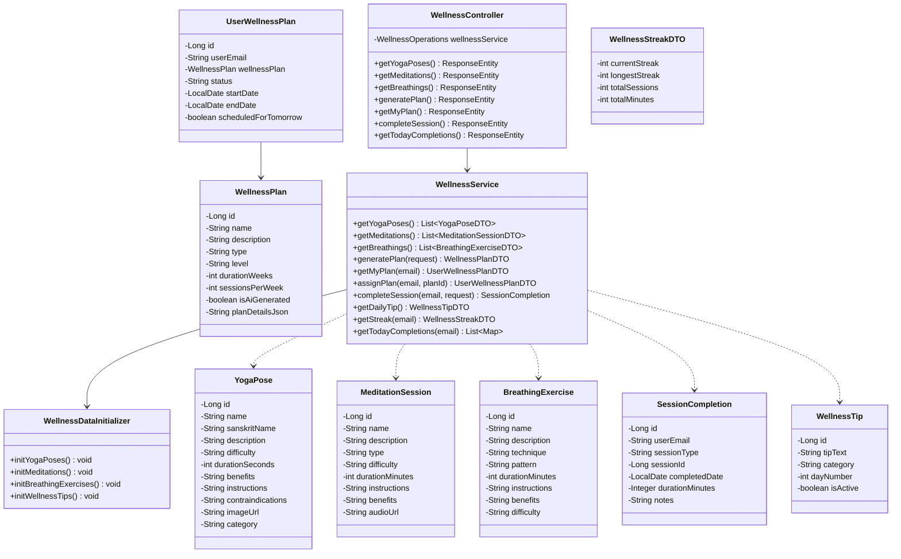

# Wellness Service — Class Diagram

```mermaid
classDiagram
    class YogaPose {
        -Long id
        -String name
        -String sanskritName
        -String description
        -String difficulty
        -int durationSeconds
        -String benefits
        -String instructions
        -String contraindications
        -String imageUrl
        -String category
    }

    class MeditationSession {
        -Long id
        -String name
        -String description
        -String type
        -String difficulty
        -int durationMinutes
        -String instructions
        -String benefits
        -String audioUrl
    }

    class BreathingExercise {
        -Long id
        -String name
        -String description
        -String technique
        -String pattern
        -int durationMinutes
        -String instructions
        -String benefits
        -String difficulty
    }

    class WellnessPlan {
        -Long id
        -String name
        -String description
        -String type
        -String level
        -int durationWeeks
        -int sessionsPerWeek
        -boolean isAiGenerated
        -String planDetailsJson
    }

    class UserWellnessPlan {
        -Long id
        -String userEmail
        -WellnessPlan wellnessPlan
        -String status
        -LocalDate startDate
        -LocalDate endDate
        -boolean scheduledForTomorrow
    }

    class SessionCompletion {
        -Long id
        -String userEmail
        -String sessionType
        -Long sessionId
        -LocalDate completedDate
        -Integer durationMinutes
        -String notes
    }

    class WellnessTip {
        -Long id
        -String tipText
        -String category
        -int dayNumber
        -boolean isActive
    }

    class WellnessService {
        +getYogaPoses() List~YogaPoseDTO~
        +getMeditations() List~MeditationSessionDTO~
        +getBreathings() List~BreathingExerciseDTO~
        +generatePlan(request) WellnessPlanDTO
        +getMyPlan(email) UserWellnessPlanDTO
        +assignPlan(email, planId) UserWellnessPlanDTO
        +completeSession(email, request) SessionCompletion
        +getDailyTip() WellnessTipDTO
        +getStreak(email) WellnessStreakDTO
        +getTodayCompletions(email) List~Map~
    }

    class WellnessDataInitializer {
        +initYogaPoses() void
        +initMeditations() void
        +initBreathingExercises() void
        +initWellnessTips() void
    }

    class WellnessController {
        -WellnessOperations wellnessService
        +getYogaPoses() ResponseEntity
        +getMeditations() ResponseEntity
        +getBreathings() ResponseEntity
        +generatePlan() ResponseEntity
        +getMyPlan() ResponseEntity
        +completeSession() ResponseEntity
        +getTodayCompletions() ResponseEntity
    }

    class WellnessStreakDTO {
        -int currentStreak
        -int longestStreak
        -int totalSessions
        -int totalMinutes
    }

    UserWellnessPlan --> WellnessPlan
    WellnessController --> WellnessService
    WellnessService --> WellnessDataInitializer
    WellnessService ..> YogaPose
    WellnessService ..> MeditationSession
    WellnessService ..> BreathingExercise
    WellnessService ..> SessionCompletion
    WellnessService ..> WellnessTip
```

