# Wellness Service — Database Architecture

## Database: `fitnessapp_wellness`

### ER Diagram

```mermaid
erDiagram
    yoga_poses {
        bigint id PK
        varchar name
        varchar sanskrit_name
        text description
        varchar difficulty "BEGINNER|INTERMEDIATE|ADVANCED"
        int duration_seconds
        text benefits
        text instructions
        text contraindications
        varchar image_url
        varchar category "STANDING|SEATED|PRONE|SUPINE|BALANCE|INVERSION"
    }

    meditation_sessions {
        bigint id PK
        varchar name
        text description
        varchar type "GUIDED|FOCUS|SLEEP|STRESS_RELIEF|BODY_SCAN|UNGUIDED"
        varchar difficulty "BEGINNER|INTERMEDIATE|ADVANCED"
        int duration_minutes
        text instructions
        text benefits
        varchar audio_url
    }

    breathing_exercises {
        bigint id PK
        varchar name
        text description
        varchar technique "BOX|FOUR_SEVEN_EIGHT|KAPALBHATI|ANULOM_VILOM|BHRAMARI"
        varchar pattern "4-4-4-4|4-7-8|rapid|alternate|humming"
        int duration_minutes
        text instructions
        text benefits
        varchar difficulty
    }

    wellness_plans {
        bigint id PK
        varchar name
        text description
        varchar type "YOGA|MEDITATION|MIXED"
        varchar level "BEGINNER|INTERMEDIATE|ADVANCED"
        int duration_weeks
        int sessions_per_week
        boolean is_ai_generated
        text plan_details_json
        timestamp created_at
    }

    user_wellness_plans {
        bigint id PK
        varchar user_email
        bigint wellness_plan_id FK
        varchar status "ACTIVE|COMPLETED|CANCELLED"
        date start_date
        date end_date
        boolean scheduled_for_tomorrow
        timestamp created_at
    }

    session_completions {
        bigint id PK
        varchar user_email
        varchar session_type "YOGA|MEDITATION|BREATHING"
        bigint session_id
        date completed_date
        int duration_minutes
        text notes
        timestamp completed_at
    }

    wellness_tips {
        bigint id PK
        text tip_text
        varchar category "MINDFULNESS|BREATHING|LIFESTYLE|NUTRITION|SLEEP|EXERCISE"
        int day_number
        boolean is_active
    }

    wellness_plans ||--o{ user_wellness_plans : assigned
    yoga_poses ||--o{ session_completions : completed
    meditation_sessions ||--o{ session_completions : completed
    breathing_exercises ||--o{ session_completions : completed
```

### Table Summary

| Table | Records | Purpose |
|-------|---------|---------|
| yoga_poses | 12 | Pre-loaded yoga pose library |
| meditation_sessions | 8 | Pre-loaded meditation types |
| breathing_exercises | 5 | Pre-loaded pranayama exercises |
| wellness_plans | Growing | Generated/pre-built plans |
| user_wellness_plans | 1 active per user | Plan assignment |
| session_completions | Multiple per user/day | Completion tracking |
| wellness_tips | 30 | Rotating daily tips |

### Unique Constraints
- `uk_user_wellness_active` — (user_email, status='ACTIVE')
- `uk_session_completion` — (user_email, completed_date, session_type, session_id)

