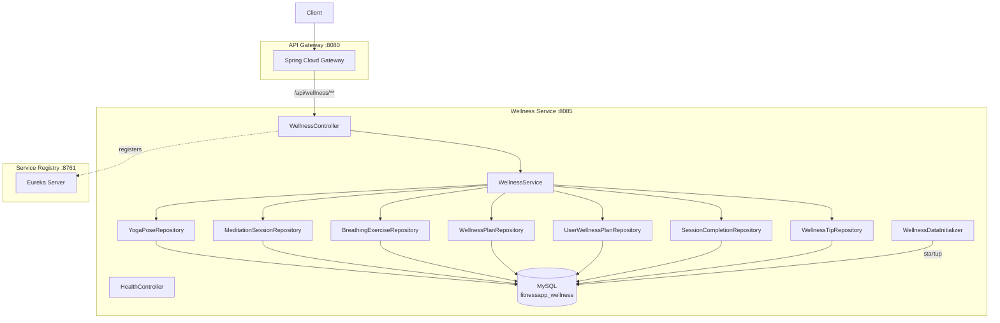

# Wellness Service — High-Level Design (HLD)

## 1. Service Overview
The Wellness Service provides yoga poses, meditation sessions, breathing exercises, wellness plan generation, session completion tracking, streaks, and daily wellness tips. It serves as the mind-body wellness domain in the platform.

## 2. Component Diagram



## 3. Key Design Decisions

### Pre-loaded Content Library
`WellnessDataInitializer` runs on application startup and seeds:
- **12 Yoga Poses** — Mountain, Downward Dog, Warrior I, Warrior II, Tree, Triangle, Cobra, Child's, Bridge, Cat-Cow, Pigeon, Corpse
- **8 Meditation Sessions** — Morning Calm, Focus Flow, Body Scan, Stress Relief, Sleep, Gratitude, Loving-Kindness, Unguided
- **5 Breathing Exercises** — Box Breathing (4-4-4-4), 4-7-8, Kapalbhati, Anulom Vilom, Bhramari
- **30 Wellness Tips** — One per day, rotating monthly

### Completion Tracking
- Sessions can be YOGA, MEDITATION, or BREATHING
- Each completion stored with user, session type, session ID, date
- Unique constraint prevents duplicate completions per session per day
- Today's completions fetched via dedicated endpoint for UI state

### Streak Calculation
- Counts consecutive days where at least one session was completed
- Walks backward from today through `session_completions` dates
- Returns current streak, longest streak, total sessions, total minutes

## 4. Module Structure
```
wellness-service/
├── api/wellness-service-api.yaml
├── wellness-service-common/    # DTOs: YogaPoseDTO, MeditationSessionDTO, BreathingExerciseDTO, WellnessPlanDTO, etc.
├── wellness-service-rest/      # WellnessController, HealthController
└── wellness-service-impl/      # WellnessService, entities, repos, data initializer
```

## 5. API Gateway Routing
| Gateway Path | Routed To |
|-------------|-----------|
| `/api/wellness/**` | `wellness-service/wellness/**` |

## 6. No External Dependencies
- Self-contained service — no inter-service calls
- All data identified by `userEmail`
- Port 8085, Database `fitnessapp_wellness`

