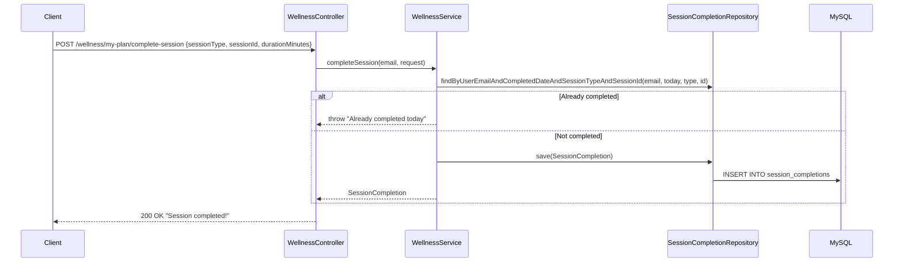
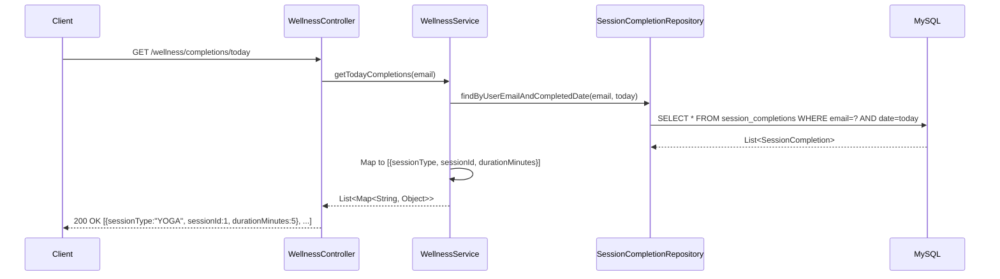
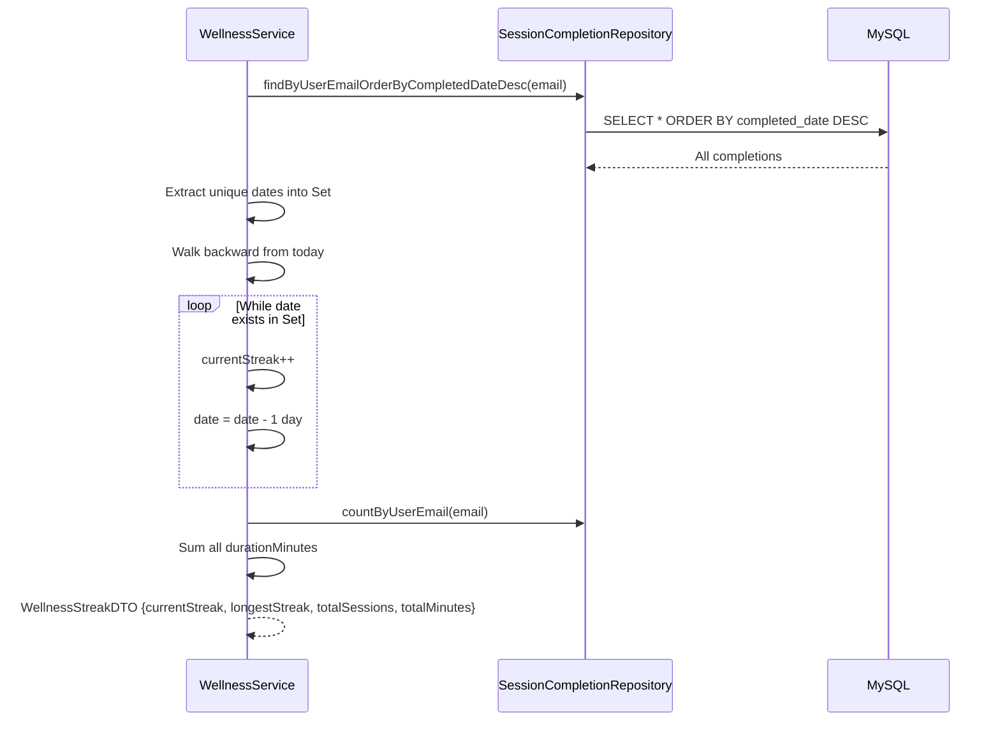

# Wellness Service — Low-Level Design (LLD)

## 1. Session Completion Flow



## 2. Today's Completions Flow



## 3. Streak Calculation Flow



## 4. API Specifications

### GET `/wellness/yoga/poses`
```json
[
  {
    "id": 1, "name": "Mountain Pose", "sanskritName": "Tadasana",
    "difficulty": "BEGINNER", "durationSeconds": 30,
    "benefits": "Improves posture, strengthens thighs",
    "instructions": "Stand tall with feet together...",
    "category": "STANDING"
  }
]
```

### GET `/wellness/meditation/sessions`
```json
[
  {
    "id": 1, "name": "Morning Calm", "type": "GUIDED",
    "difficulty": "BEGINNER", "durationMinutes": 10,
    "description": "Start your day with peace and clarity"
  }
]
```

### GET `/wellness/breathing/exercises`
```json
[
  {
    "id": 1, "name": "Box Breathing", "technique": "BOX",
    "pattern": "4-4-4-4", "durationMinutes": 5,
    "description": "Equal inhale, hold, exhale, hold"
  }
]
```

### POST `/wellness/generate-plan`
```json
// Request
{ "type": "MIXED", "level": "BEGINNER", "durationWeeks": 4, "sessionsPerWeek": 3 }

// Response
{
  "id": 1, "name": "4-Week Beginner Mixed Plan",
  "type": "MIXED", "level": "BEGINNER",
  "durationWeeks": 4, "sessionsPerWeek": 3,
  "sessions": [
    { "dayOfWeek": "MONDAY", "type": "YOGA", "items": ["Mountain Pose", "Warrior I", "Tree Pose"] },
    { "dayOfWeek": "WEDNESDAY", "type": "MEDITATION", "items": ["Morning Calm - 10 min"] },
    { "dayOfWeek": "FRIDAY", "type": "BREATHING", "items": ["Box Breathing - 5 min", "4-7-8 - 5 min"] }
  ]
}
```

### POST `/wellness/my-plan/complete-session`
```json
// Request
{ "sessionType": "YOGA", "sessionId": 1, "durationMinutes": 5 }
// Response: 200 OK
```

### GET `/wellness/completions/today`
```json
[
  { "sessionType": "YOGA", "sessionId": 1, "durationMinutes": 5 },
  { "sessionType": "BREATHING", "sessionId": 3, "durationMinutes": 10 }
]
```

### GET `/wellness/streak`
```json
{ "currentStreak": 7, "longestStreak": 14, "totalSessions": 45, "totalMinutes": 320 }
```

### GET `/wellness/tips/daily`
```json
{ "id": 15, "tipText": "Practice 5 minutes of deep breathing before meals to improve digestion.", "category": "BREATHING", "dayNumber": 15 }
```

## 5. Service Layer Methods

| Method | Parameters | Returns | Description |
|--------|-----------|---------|-------------|
| `getYogaPoses` | — | List\<YogaPoseDTO\> | All yoga poses |
| `getMeditations` | — | List\<MeditationSessionDTO\> | All meditation sessions |
| `getBreathings` | — | List\<BreathingExerciseDTO\> | All breathing exercises |
| `generatePlan` | WellnessPlanRequest | WellnessPlanDTO | Generate wellness plan |
| `getMyPlan` | email | UserWellnessPlanDTO | Active plan |
| `assignPlan` | email, planId | UserWellnessPlanDTO | Assign plan |
| `completeSession` | email, CompletionRequest | SessionCompletion | Mark done |
| `getDailyTip` | — | WellnessTipDTO | Today's tip |
| `getStreak` | email | WellnessStreakDTO | Streak info |
| `getTodayCompletions` | email | List\<Map\> | Today's completed sessions |

## 6. Pre-loaded Content

### 12 Yoga Poses
Mountain, Downward Dog, Warrior I, Warrior II, Tree, Triangle, Cobra, Child's, Bridge, Cat-Cow, Pigeon, Corpse (Savasana)

### 8 Meditation Sessions
Morning Calm, Focus Flow, Body Scan, Stress Relief, Sleep Well, Gratitude, Loving-Kindness, Silent

### 5 Breathing Exercises
Box Breathing (4-4-4-4), 4-7-8 Relaxation, Kapalbhati (Skull Shining), Anulom Vilom (Alternate Nostril), Bhramari (Bee Breathing)

### 30 Wellness Tips
Daily rotating tips covering mindfulness, breathing, sleep hygiene, hydration, movement, and Indian wellness traditions.

## 7. Error Handling
| Error | HTTP Code | Message |
|-------|-----------|---------|
| Already completed | 400 | "Already completed today" |
| No active plan | 404 | "No active wellness plan" |
| Plan not found | 404 | "Plan not found" |
| Invalid session type | 400 | "Invalid session type" |

